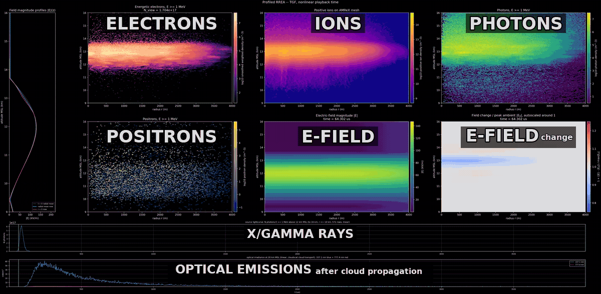

# RREA with WarpX and AMReX

The central idea of this project is to combine WarpX and AMReX with particle
transport data extracted from Geant4 in one self-consistent Relativistic
Runaway Electron Avalanche (RREA) model, including relativistic feedback from
X-rays, gamma rays, and positrons. WarpX owns the entire kinetic part of the
model: it transports electrons, positrons, and photons using the Geant4-derived
cross sections and final-state data for their interactions.
AMReX evolves the low-energy carrier fluid and electric field. The vendored
JAEA PARMA model adds realistic cosmic-ray secondary electron/positron seeding.

The goal is to reproduce the observed range of high-energy thunderstorm
phenomena, including terrestrial gamma-ray flashes (TGFs), flickering gamma-ray
flashes (FGFs), and gamma-ray glows, in a realistic altitude-dependent
atmosphere with self-consistent electric-field evolution and full relativistic
feedback from X-rays, gamma rays, and positrons.

<p align="center">
  
</p>
<p align="center"><em>PARMA-seeded 200 us simulation through field quenching and peak activity (12.5 s excerpt).</em></p>

This is primarily a scientific proof of concept rather than a production
software project. It tests whether these established components can be
combined into a physically credible end-to-end RREA model; it is not intended
to be a polished, portable, user-supported simulation package.

## Philosophy: vibe coding

This project is intentionally developed and operated through vibe coding. Code
changes, simulations, and repository maintenance are delegated to AI agents
instead of being performed manually. The model scope is fixed: agents operate
and improve the two production scenarios defined below and the RREA
Coleman--Dwyer multiplication test; they do not reshape the model around
arbitrary physics questions. Vibe coding describes how this repository is
maintained and run.
Results are evaluated after each run using governing equations, physical
consistency checks, and committed tests. The goal is never to edit a line of
code by hand.
[`CLAUDE.md`](CLAUDE.md) is the single policy source.

## Production scenarios

`seed_source_model` in `config/rrea_defaults.json` selects one of two production
scenarios:

- `parma_continuous_column` (default): a continuous cosmic-ray secondary
  electron/positron column plus its stationary background at t = 0, derived
  from PARMA (`scripts/rrea_parma_source.py`). This is the realistic
  thunderstorm seeding environment and the default production mode.
- `production_mono_1mev`: a mono-energetic 1 MeV pulse injected in a narrow
  source region, representing the intense secondary burst of a very high
  energy cosmic-ray shower.

The separate `coleman_dwyer_7p2mev` mode is not a production scenario. It uses
the RREA Coleman--Dwyer seed cohort to test pure RREA multiplication in
isolation.

## Production path and GPU branch

The repository keeps one schema-6 profiled-atmosphere production path. Its run
geometry, schedule, population policy and HPC layout are owned by
`config/rrea_defaults.json`; Git history holds superseded implementations.
The Slurm launchers in `cluster/hpc/` are site-agnostic: login, work root,
Slurm account and module stack live in private local configuration, never in
this repository, so no specific cluster is named here.

The `gpu-cuda` branch carries an experimental CUDA port of the RREA overlay.
It is an exploration, not a speed win: on a consumer GPU such as an RTX 4060
(8 GB) it runs about 8x slower than the 12-core CPU path. The CUDA build is
currently a work in progress and remains unvalidated for production use.

## Project contract

The tracked kinetic
bundle lives in `rrea_transport_tables/schema6/production/` as RREATBL
containers; the low-energy table lives in `rrea_fluid_closure/`.
The C++ loaders enforce runtime semantics; focused tests and the fluid-source
scripts check the shipped physical data.
`scripts/rrea_table_pack.py --help` is the reference: `dump` reads a table
without unpacking, `unpack` restores the original files beside their
containers, and `pack` is for a
replacement table set only -- it deletes each source file it packs.

## Layout

```text
native_amrex_rrea/     native AMReX state plus the WarpX RREA overlay
rrea_transport_tables/ and rrea_fluid_closure/ kinetic and fluid input data
rrea_parma_upstream/   vendored PARMA cosmic-ray model code and data (JAEA)
upstream/             exact WarpX/AMReX/Geant4 gitlinks to the davsar89 forks
cases/rrea/            canonical production input
EFIELD_profile/        altitude-dependent field and density profiles
cluster/hpc/           site-agnostic Slurm launchers and campaign planner
scripts/               production runner, analysis, validation, and rendering
docs/                  live architecture, rerun, and HPC guides
```

Start with:

- [`CLAUDE.md`](CLAUDE.md) for repository policy.
- [`docs/RREA_RERUN_GUIDE.md`](docs/RREA_RERUN_GUIDE.md) for local runs,
  restarts, products, and the all-physics campaign.
- [`Architecture guide (PDF)`](docs/RREA_WARPX_AMREX_ARCHITECTURE_GUIDE.pdf)
  for architecture and physics ownership.
- [`PIC explainer (PDF)`](docs/rrea_pic_explainer.pdf) for a shorter narrative
  introduction to the hybrid kinetic/fluid model and diagnostics.
- [`docs/README.md`](docs/README.md) for the live documentation index and active
  caveats.
